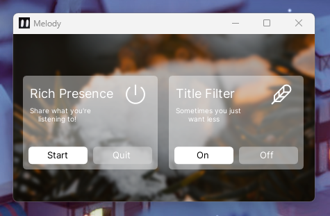

<p align="center">
	
	<h1 align="center">Melody</h1>
</p>

<div align="center">
	
	
	<a href="https://github.com/qwertyquerty/pypresence">
		
		
	</a>
</div>

</br>

## Description
A YouTube Music Discord Rich-Presence App utilizing  and 

## Examples



## Prerequisites
1. Go to <a href="https://discord.com/developers/applications" alt="discord developers applications"> Discord Developer Portal </a>
2. Create a new application
3. Get your Application ID
4. Create a new environment variable named "MELODY_RPC_APP_ID" and add that ID as the value.
5. Continue onto [Building](#building)

## Building
> Make sure your python version is 3.10 or greater
1. Paste this command into your shell
	- If it doesn't work, you may need to add this line after the --icon and before -F
		-	`--paths= { PATH_TO_YOUR_PYTHON_LIB_SITE-PACKAGES }`
		-	Example: `--paths=C:/Python311/Lib/site-packages`
```shell
pyinstaller -n melody --windowed --icon=assets/dmi.ico -F src/mel.py
```

2. unzip assets into `dist/` output folder
3. You can now open YouTube Music and play a song!

## Important Additional Info
- Rich Presence only updates once every 15 seconds (per Discord API limit)

- Prefer to close the application normally instead of using the quit button (both do the same thing,  dearpygui framework limitation)
	- If you decide to use the quit button, wait 5 seconds before closing the application

- If there is no album title found, the song's title will be used as the album title

- If 11 URLs are visited, the application will assume you have paused the media session, you will need to reload the tab or select another song

- Currently, the application does not check if discord is closed (should this happen, you will need to close the chromium instances created by the application)

## Acknowledgements
Background photo by  on 

Icons by:
-   on 	
-   on 
